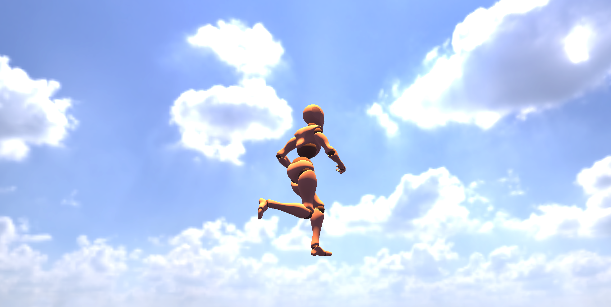

# Marma VR

## Создать three.js сцену с учётом перечисленных пунктов:
1) С возможностью вращения камеры вокруг .glb модели (модель прилагается)
2) Модель должна воспроизводить анимацию run (находится в самой модели)
3) С возможностью приближения и отдаленния камеры вращением колёсика мыши
4) Добавить в сцену directionLight и включить возможность отображения на моделе падающих и собственных теней (castShadows, receiveShadows)
5) Добавить в сцену .hdr карту (файл прилагается) и "закрасить" ей фон сцены
6) Использовать raycaster таким образом чтобы при клике на модель изменялся масштаб модели на х2. При повторном клике возвращался обратно

<br/>

## System Requirements
```
node.js ~ 0.18.0 version
```
<br/>

## Usage: Installation
```
cd marma-vr 
npm install -D vite    #  Install the Vite tool
npm install            #  Installing dependencies ~
npm run dev            #  Run in developer mode
```
<br/>

## Preview
